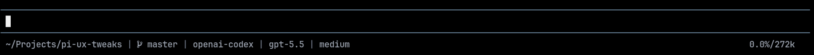

# Pi Footer

[](https://www.npmjs.com/package/@zigai/pi-footer)
[](https://www.npmjs.com/package/@zigai/pi-footer)
[](../../LICENSE)

This Pi extension replaces Pi's footer with a single compact plain-text status line.



Footer contents:

- current working directory
- git branch
- provider and model
- thinking level
- MCP status
- context usage

## Install

```sh
pi install npm:@zigai/pi-footer
```

## Configuration

Configure global settings at `~/.pi/agent/pi-footer/config.json`.

| Option      | Type     | Default | Description                                                                                  |
| ----------- | -------- | ------- | -------------------------------------------------------------------------------------------- |
| `separator` | `string` | `"\|"`  | Visible separator placed between footer status segments. Whitespace-only values are ignored. |

```json
{
  "$schema": "./config.schema.json",
  "separator": "|"
}
```

## License

MIT
