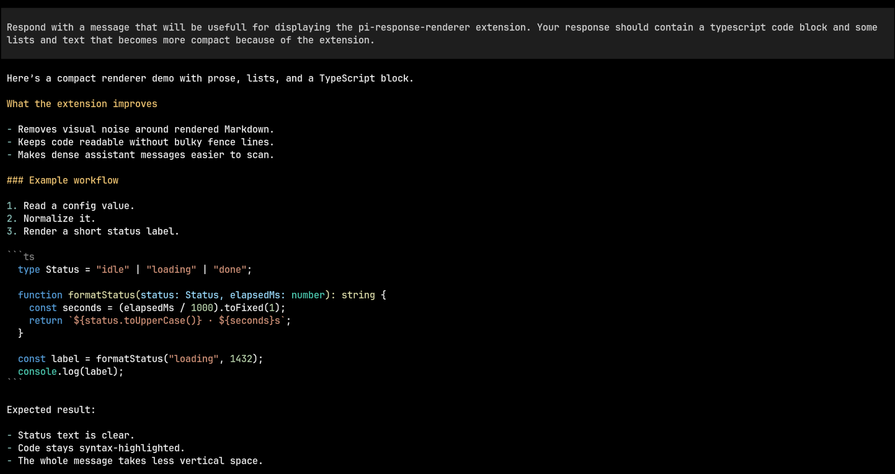
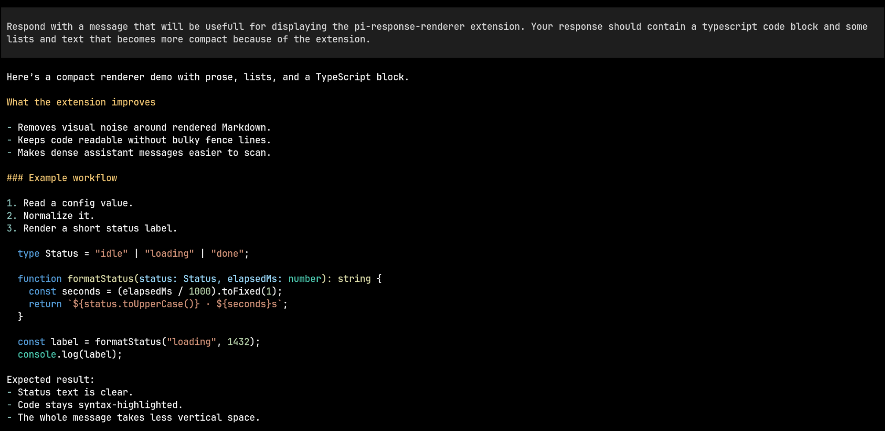

# Pi Response Renderer

[](https://www.npmjs.com/package/@zigai/pi-response-renderer)
[](https://www.npmjs.com/package/@zigai/pi-response-renderer)
[](../../LICENSE)

This Pi extension makes assistant responses more compact by tightening extra blank lines and hiding Markdown code fence markers.

It applies a few small rendering tweaks:

- hides the visible ``` fence lines around rendered Markdown code blocks in assistant messages
- collapses paragraph gaps without squeezing tables or headings
- removes italic ANSI styling from assistant message output

The goal is a cleaner transcript with less visual noise while keeping the message content itself unchanged.

## Install

```sh
pi install npm:@zigai/pi-response-renderer
```

The extension only changes how messages are rendered in the UI. It does not rewrite saved conversation content.

## Screenshots

Before:



After:



## License

MIT
